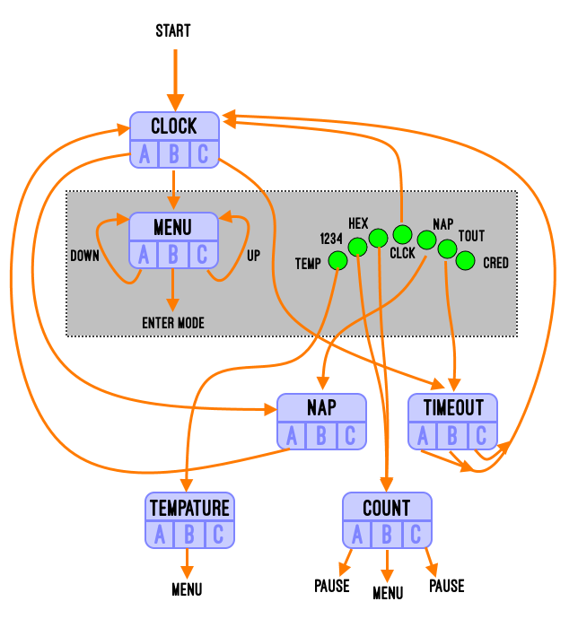

# Clocky

A Python 3 clock for the Pimoroni RainbowHAT with additional timing based.

## Features

[](https://www.youtube.com/watch?v=KbR4uZ97ric "Clocky Demo")

* :alarm_clock: Clock
* :1234: Count up by Decimal
* :capital_abcd: Count up by Hex
* :hourglass: Two minutes "timeout" countdown timer
* :sunny: Tempature (ºF/ºC toggle)
* :rainbow: more...

LEDs are sunny bright during the day, stars cross the sky at night, and a sunrise/sunset transition the hour between the two.

## Pre-requisites

* Raspberry Pi (RPI) 0w or higher small board computer
* An RPI operating system with Python3 such [Raspberry Pi OS](https://www.raspberrypi.org/downloads/raspberry-pi-os/) (previously called Raspbian)
* A [Rainbow Hat for Android Things](https://shop.pimoroni.com/products/rainbow-hat-for-android-things) connected to the GPIO pins

## Build and install

Copy this file into your pi home directory.

```bash
cp clocky.py /home/pi
```

Set the script to run at startup by adding the following before the `exit 0` in `/etc/rc.local`:

```bash
sudo python3 /home/pi/clocky.py &
```

A few other alternatively methods to start the script when the RPI boots up can be found at [dexterindustries.com](https://www.dexterindustries.com/howto/run-a-program-on-your-raspberry-pi-at-startup/)

## Manual



### Startup & Menu

After a short startup sequence, Clocky is in "clock mode".
Use the **A**, **B**, and **C** buttons to change modes.  **B** in most any mode for the menu.

When in the menu:
**A** moves down the selected menu item
**B** select the current mode (exit the menu)
**C** moves up the selected menu item

### Clock Mode

**A** will immediately jump to "nap mode".  This mode is the same as clock mode except the LEDs are dimmed for 2 hours.
**B** will take you to the menu.
**C** will immedately take you to the two minute timeout mode.

### Tempature Mode

**A** Does nothing.
**B** Goes back to the main menu
**C** Toggles between Fahrenheit and Celsius.

### Counting Modes

In decimal ("1234") or hexidecimal ("ABCD") modes the LEDs will show the binary representation of the number currently counting up.
**A** (Un)pause
**B** Exit mode, go back to menu
**C** (Un)pause

### Timeout Mode

Countdown for two minutes (120 seconds.) When it reaches 0 a short tune will play and the LED display will show "done".
**A** Back to clock mode
**B** Back to clock mode
**C** Back to clock mode

**A** (Un)pause
**B** Exit mode, go back to menu
**C** (Un)pause

## License

The MIT License:
Copyright :copyright:2020 Tronster Hartley
[mit-license.org](https://mit-license.org/)
